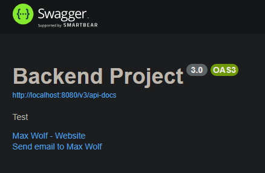

# A Spring Boot Project for Backend
- [Frontend Demo for this backend project](https://github.com/maxwolf621/SpringBootFrontend)

## Concept
- jwt (login & reset password).
- `@schedule` to delete expired token and invalid user.
- `lombok` and `mapstruct` (DTOs & POJO)
- Oauth2(`google` , `github`)
- Mysql & Redis & Caffeine & JPA 
- AOP (logs)
- Junit5 & Swagger-ui

Swagger-ui `http://localhost:8080/swagger-ui/`   
  

