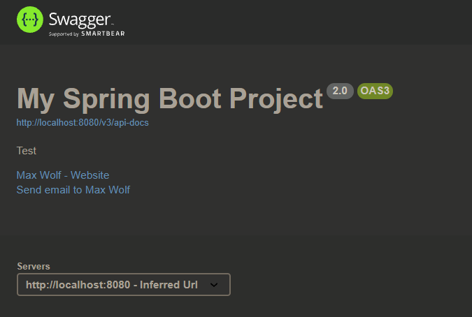

# A Spring Boot Project for Backend
- [Frontend Demo for this backend project](https://github.com/maxwolf621/SpringBootFrontend)
## Design in this Project
- jks to generate jwt for user to login, reset their password.
- `@schedule` to delete expired token, invalid user.
- `lombok` and `mapstruct` for DTOs and Models
- Oauth2(`google` , `github`)
- Mysql & Redis & Caffeine & JPA 
- AOP (logs)
- Junit5 & Swagger-ui

Swagger-ui `http://localhost:8080/swagger-ui/`
    

